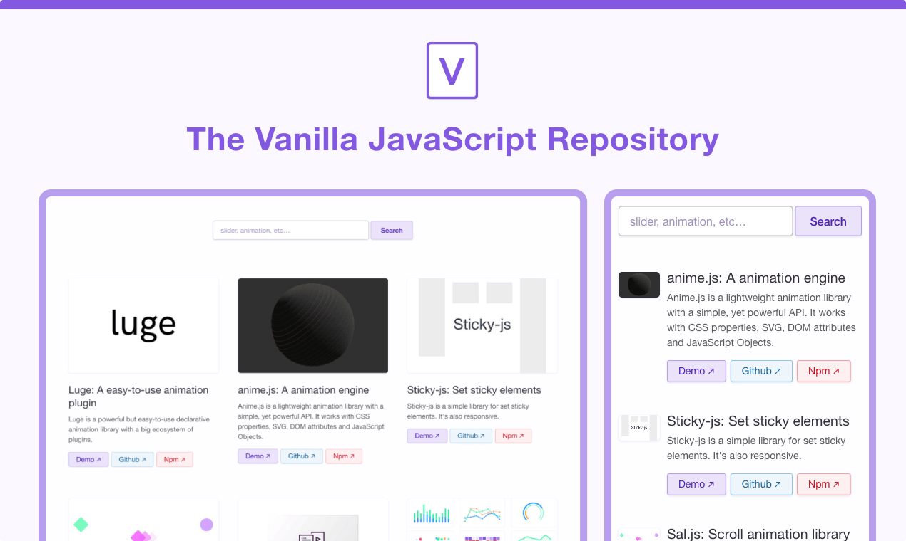

# Vanilla List

**Find the best JS plugins for your next project in this handpicked collection and save time as a developer!**

Available at [https://vanillalist.top](https://vanillalist.top)

> [!Note]
> The project is **temporary** in hiatus mode. Everything is [explained in this post](https://github.com/GuerillaStudio/vanillalist/discussions/49).

---



## Development Scripts

**`npm ci`**

> Install build dependencies without impacting the package-lock file

**`npm run start`**

> Run 11ty with hot reload at localhost:1312, including reload based on Sass changes

**`npm run build`**

> Production build includes minified, autoprefixed CSS

## Contribute

Be sure to read the [Code of Conduct](CODE_OF_CONDUCT.md) and to follow the [contribution guide](CONTRIBUTING.md) before making a Pull-Request :)

### Check broken links easily

```
npx broken-link-checker https://vanillalist.top -roi
```

## License

The project is under [Anti-Fascist MIT License](https://github.com/Laurelai/anti-fascist-mit-license)

Plugin's visuals belong to their respective owners
